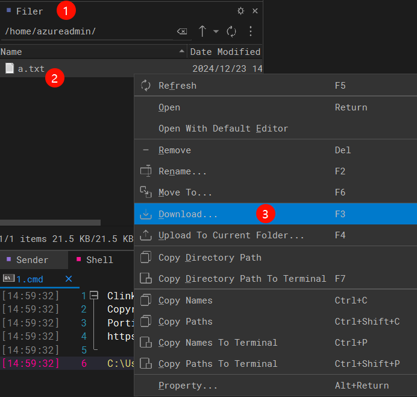

## How to download files from remote VMs

### 1. Use WindTerm to download files from remote VMs(Recommended)
- Download WindTerm from [releases](https://github.com/kingToolbox/WindTerm/releases)
- Run WindTerm and connect to your VM
- Navigate to the file in the file explorer and right click on the file and select "Download"
  - 